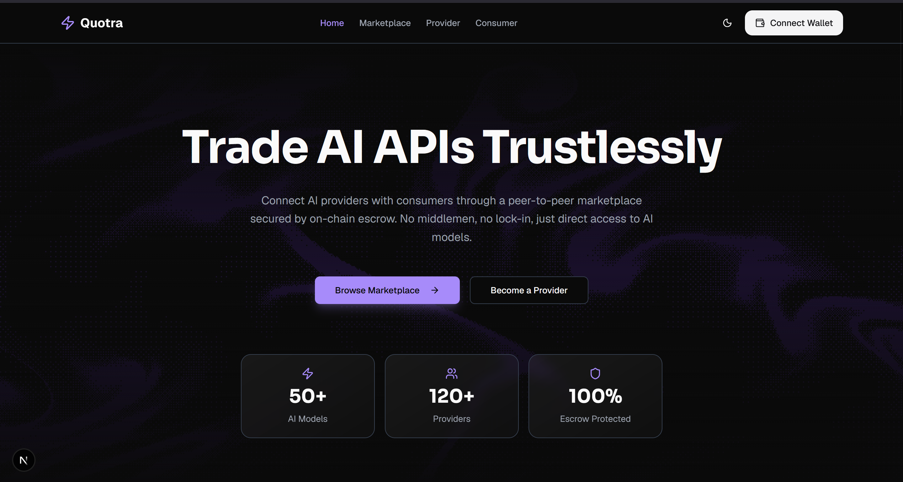
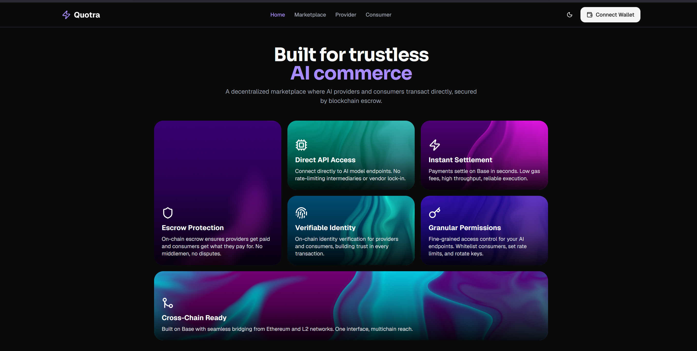

<div align="center">
  
  
  <h1>🚀 Quotra</h1>
  <p><strong>Sell your idle AI quota, buy LLM access per-call — no credit card, no commitment.</strong></p>
  
  <p>
    Built for the <b>MetaMask Smart Accounts Kit × 1Shot API Dev Cook-Off</b> <br/>
    Track: <i>Best Use of x402 + ERC-7710</i>
  </p>
</div>

---

## 💡 The Problem

The current landscape of premium AI APIs (like Venice AI, OpenAI, Anthropic) suffers from two major inefficiencies:

1. **The Credit Card Barrier:** Millions of developers, students, and hackathon builders in emerging markets cannot access premium LLM APIs because they lack the ability to clear traditional fiat credit card billing.
2. **Idle Subscription Waste:** Power users who pay for premium tiers (e.g., $68/month) rarely utilize 100% of their monthly credit allocations, resulting in massive wasted spend that auto-renews every month.

## 🌟 The Solution: Quotra

Quotra is a **Decentralized P2P AI API Marketplace**. We connect users who have excess AI API quota with developers who need API access on a pay-as-you-go basis.

No subscriptions. No fiat billing. No middlemen hoarding the profits.



### 🔑 Core Innovations

- **💸 P2P Revenue Routing:** 90% of all payments go directly to the individual API provider's wallet, not a centralized reseller platform.
- **🛡️ On-Chain Authorization (ERC-7710):** Providers grant quota access through mathematically auditable and revocable smart contract delegations.
- **⚡ HTTP-Native Micropayments (x402):** Consumers pay exactly for what they use per API call using USDC over HTTP.
- **⛽ ETH-Free Experience:** Powered by **MetaMask Smart Accounts** and the **1Shot Relayer**, users can transact using solely USDC without ever worrying about gas fees.
- **🔒 Escrow Treasury Model:** Payments are settled securely in escrow to guarantee atomic execution and easy refunds.

---

## 👥 Who is this for?

> [!TIP]
> **For Providers (The Sellers)**  
> *Monetize your unused API quota.* Got a Venice AI Pro+ plan but only using 30% of it? Connect your wallet, register your API key, sign an ERC-7710 delegation, and start earning passive USDC income while you sleep.

> [!TIP]
> **For Consumers (The Buyers)**  
> *Access premium models instantly.* Need an LLM endpoint for a hackathon or a school project? Browse the Quotra marketplace, pick a model (e.g., Llama 3 70B, Stable Diffusion XL), and pay per-call using USDC from your crypto wallet. No credit cards required.

---

## 🛠️ How It Works Under the Hood

Quotra combines bleeding-edge Web3 standards to create a seamless Web2-like experience:

1. **Provider Listing:** A provider inputs their Venice AI API key. The key is encrypted locally (AES-256-GCM) and safely stored in Supabase. The provider signs an **ERC-7710** delegation authorizing Quotra to act on their behalf.
2. **Consumer Payment:** When a consumer makes a request, they are prompted via **ERC-7715** for session auth. The HTTP request includes an **x402** payment header.
3. **The Proxy (Gateway):** Quotra's backend intercepts the request, deducts the USDC payment into the treasury escrow, decrypts the provider's API key in-memory, and forwards the exact prompt to the AI provider.
4. **Settlement:** The AI response is streamed back to the consumer, and the provider can claim their accumulated USDC earnings directly to their smart account.

---

## 💻 Tech Stack

- **Frontend & Gateway:** Next.js 14 (App Router), React, TailwindCSS
- **Smart Accounts & Gasless:** MetaMask Smart Accounts Kit, Pimlico Bundler
- **Web3 Standards:** x402 (HTTP Micropayments), ERC-7710 (Delegation), ERC-7715 (Permissions)
- **Database & Auth:** Supabase (PostgreSQL, RLS)
- **AI Backend:** Venice AI (Privacy-first LLM inference)

---

## 🚀 Running Locally

> [!IMPORTANT]
> You need a Supabase project and a 1Shot Dev Platform account to run this locally.

1. Clone the repository and install dependencies:
   ```bash
   npm install
   ```
2. Copy `.env.example` to `.env` and fill in your API keys (Supabase, 1Shot API, Pimlico).
3. Generate an encryption key for your local instance:
   ```bash
   node -e "const { randomBytes } = require('crypto'); console.log(randomBytes(32).toString('base64'))"
   ```
4. Run the database seed script to populate the marketplace with dummy data:
   ```bash
   npx tsx --env-file=.env scripts/seed.ts
   ```
5. Start the development server:
   ```bash
   npm run dev
   ```

---
<div align="center">
  <p><i>Built with 🩵 for a more accessible AI future.</i></p>
</div>
