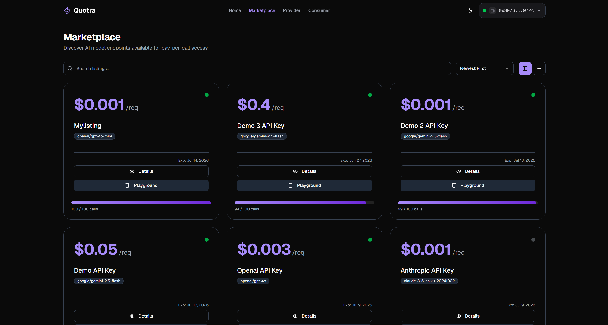
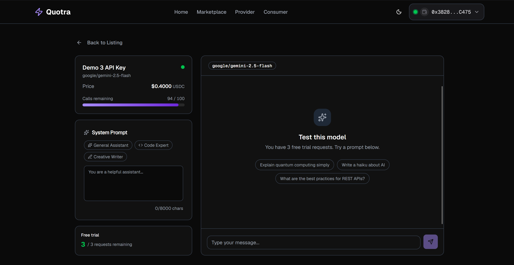
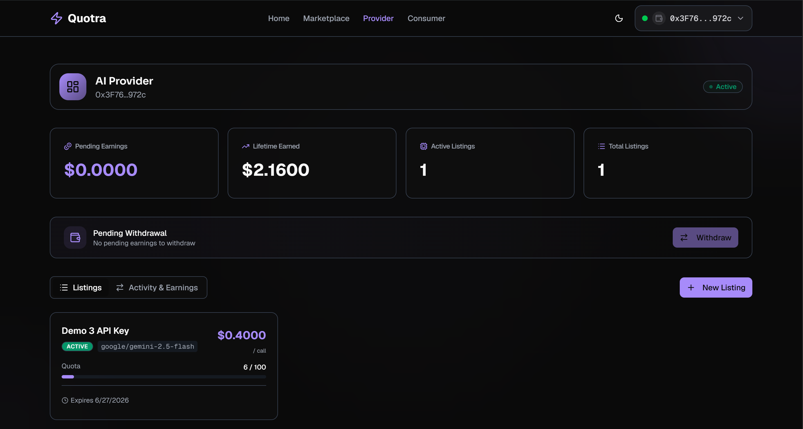
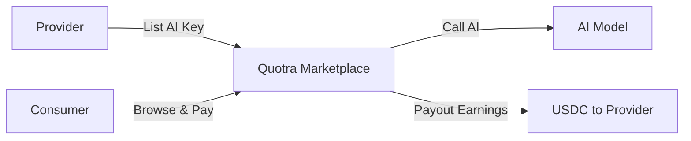

<div align="center">
  

  <h1>🚀 Quotra</h1>
  <p><strong>Sell your idle AI quota, buy LLM access per-call — no credit card, no commitment.</strong></p>

  <p>
    
    
    
    
    
    
  </p>

  <p>
    <b>MetaMask Smart Accounts Kit × 1Shot API Dev Cook-Off</b><br/>
    Tracks: <i>Best Use of x402 + ERC-7710</i> & <i>Best 1Shot API Project</i>
  </p>
</div>

---

## 💡 The Problem

The current landscape of premium AI APIs suffers from two major inefficiencies:

1. **The Credit Card Barrier** — Millions of developers, students, and hackathon builders in emerging markets cannot access premium LLM APIs because they lack credit cards or face regional billing restrictions.
2. **Idle Subscription Waste** — Power users who pay for premium tiers rarely utilize 100% of their monthly credit allocations, resulting in massive wasted spend that auto-renews.

## 🌟 The Solution

**Quotra** is a decentralized P2P AI API marketplace. Users with excess AI API quota connect their wallets and list their keys. Consumers browse the marketplace and pay per-call using USDC — no subscriptions, no fiat billing.

<div align="center">
  <table>
    <tr>
      <td width="50%"></td>
      <td width="50%"></td>
    </tr>
    <tr>
      <td align="center"><b>Marketplace</b> — Browse & filter AI listings</td>
      <td align="center"><b>Playground</b> — Free trial before purchase</td>
    </tr>
    <tr>
      <td width="50%"></td>
      <td width="50%"></td>
    </tr>
    <tr>
      <td align="center"><b>Provider Dashboard</b> — Earnings & listing management</td>
      <td align="center"><b>Key Features</b> — P2P, escrow, gasless</td>
    </tr>
  </table>
</div>

---

### Data Flow

| Step | Component | Description |
|------|-----------|-------------|
| 1 | **Provider** | Connects wallet, encrypts API key (AES-256-GCM) via `POST /api/providers/listings`, stores encrypted key in Supabase |
| 2 | **Consumer** | Browses marketplace, grants ERC-7715 session permission via MetaMask, calls `POST /api/v1/[listingId]/chat` |
| 3 | **x402 Gateway** | Returns HTTP 402 with payment params → consumer pays USDC via MetaMask Facilitator → retries with payment proof |
| 4 | **AI Proxy** | Verifies ERC-7715 permission in DB, decrypts provider key, streams AI response, records transaction |
| 5 | **Claim** | Provider triggers `POST /api/escrow/claim` → treasury builds ERC-7710 delegation → 1Shot relayer sends USDC → webhook verifies status via Ed25519 |

---

## 🛠️ How It Works



### 1. Provider Listing

A provider connects their wallet, enters their AI API key (OpenAI / Anthropic / Google), and sets a per-call price. The key is encrypted **locally** in the browser (AES-256-GCM) before being stored in Supabase — the server never sees the raw key.

### 2. Consumer Discovery & Session

Consumers browse active listings in the marketplace, filter by model/price, and try models for free in the **Playground** (3 free calls per listing). To purchase, they grant an **ERC-7715** session permission via MetaMask, creating an ephemeral session key stored in `localStorage`.

### 3. Pay-per-Call (x402)

Each API call follows the [x402](https://docs.metamask.io/smart-accounts-kit/guides/x402/) protocol:
1. Client sends request → server returns **HTTP 402** with payment parameters
2. MetaMask Facilitator processes the USDC payment (ERC-7710 delegation)
3. Client retries with `X-PAYMENT` header → server verifies and forwards to AI provider

### 4. AI Proxy & Streaming

The gateway decrypts the provider's API key in-memory, validates the request against the provider's model/input limits, calls the upstream AI provider, and streams the response back to the consumer.

### 5. Provider Claim

Earnings accumulate in the treasury escrow (90% to provider, 10% platform fee). Providers claim USDC via `POST /api/escrow/claim`:
- Treasury signs an **ERC-7710** delegation to the **1Shot Permissionless Relayer**
- Relayer estimates the fee, simulates the transaction, and submits it
- Relayer sends a **signed Ed25519 webhook** to `/api/webhooks/relayer` with the final status
- Webhook signature is verified using JWKS from `relayer.1shotapi.com`

---

## 🔑 Key Technologies

### MetaMask Smart Accounts Kit (`@metamask/smart-accounts-kit`)

The backbone of Quotra's on-chain UX:

- **ERC-7702 Smart Accounts** — `Implementation.Stateless7702` for both consumer session accounts and the treasury EOA, enabling gasless transaction signing without a bundler
- **`createDelegation` + `signDelegation`** — Treasury programmatically creates ERC-7710 delegations for relayer-based USDC payouts
- **`requestExecutionPermissions`** — Consumers grant ERC-7715 session permissions (`native-token-allowance` with 0 spending); providers grant periodic USDC allowance (`erc20-token-periodic`)
- **`x402Erc7710Client`** — Bridges delegations into the x402 payment protocol for per-call micropayments

### ERC-7710 (Delegation)

ERC-7710 enables the treasury to delegate USDC transfer authority to the **1Shot Permissionless Relayer**. The treasury:
1. Creates a delegation scoped to `amount + relayerFee` via `ScopeType.Erc20TransferAmount`
2. Signs it with `signDelegation`
3. Passes it to `relayer_send7710Transaction` which executes both the fee payment and the provider payout atomically

### ERC-7715 (Execution Permissions)

Two distinct permission flows:

- **Consumer Session** (`native-token-allowance`, 1 wei, 7 days) — MetaMask prompts the user to authorize an ephemeral session key for x402 payment headers. The server verifies the permission exists in `consumer_permissions` before processing calls.
- **Provider Fee Allowance** (`erc20-token-periodic`, 1 USDC/day, 90 days) — Providers pre-authorize USDC spending for relayer fees, set once during listing creation.

### x402 (HTTP 402 Payment Protocol)

The `@x402/next` SDK intercepts API routes, returns `402 Payment Required` with MetaMask Facilitator payment parameters, and verifies payment proofs on retry. Route config uses `assetTransferMethod: "erc7710"` to match the delegation flow.

### 1Shot Permissionless Relayer

A **public JSON-RPC service** (`relayer.1shotapi.dev`) that relays ERC-7710 delegated transactions without requiring an API key:

- `relayer_getCapabilities` — discover supported chains, USDC token, fee collector, and target address
- `relayer_estimate7710Transaction` — simulate and quote the relayer fee for a given bundle
- `relayer_send7710Transaction` — submit the signed delegation bundle for execution
- `destinationUrl` — optional webhook URL for status updates (type 4 = submitted, 0 = confirmed, 1 = failed)

### Ed25519 Webhook Verification

All relayer webhooks are signed with Ed25519. The server:
1. Caches JWKS from `https://relayer.1shotapi.com/.well-known/jwks.json`
2. Looks up the public key by `kid`
3. Reconstructs the canonical JSON payload (sorted keys)
4. Verifies the base64 signature using `@noble/ed25519`

### Additional Infrastructure

| Layer | Technology |
|-------|-----------|
| **ORM / Query** | TanStack Query (client-side data fetching) |
| **Styling** | Tailwind CSS v4 + Radix UI + shadcn/ui |
| **Auth** | JWT (HS256, 24h expiry) via wallet sign-in (nonce → signature → verify) |
| **Rate Limiting** | Upstash Redis |
| **Testing** | Vitest + jsdom + @testing-library/react (85+ tests) |
| **Lint / Type** | ESLint v9 + TypeScript strict |

---

## 🔌 Consumer API Gateway

Once a consumer has granted an ERC-7715 session permission, they call the gateway endpoint:

**Endpoint:** `POST /api/v1/[listingId]/chat`

**Required Headers:**
- `Content-Type: application/json`

**Optional Headers:**
- `x-wallet-address` — consumer wallet (auto-detected from x402 payment if omitted)
- `X-PAYMENT` — set automatically by x402 client after HTTP 402

**Request:**
```json
{
  "chat": "Explain blockchain in simple terms.",
  "systemPrompt": "You are a helpful assistant.",
  "maxOutputTokens": 500    //optional
}
```

**Response (streaming):** Server-sent events with the AI response streamed token-by-token.

> **Note:** The gateway is stateless. The consumer sends the full message history per request. Total input characters are validated against the provider's `max_input_chars` limit.

### API Routes Reference

| Method | Path | Auth | Purpose |
|--------|------|------|---------|
| `POST` | `/api/auth/nonce` | None | Generate sign-in nonce |
| `POST` | `/api/auth/login` | None | Verify signature → issue JWT |
| `GET` | `/api/listings` | None | Browse active listings |
| `GET` | `/api/listings/[id]` | None | Listing detail |
| `POST` | `/api/v1/[listingId]/chat` | x402 | Payment-gated AI call |
| `POST` | `/api/providers` | JWT | Register as provider |
| `POST` | `/api/providers/listings` | JWT | Create new listing |
| `GET` | `/api/providers/dashboard` | JWT | Provider dashboard data |
| `POST` | `/api/permissions` | JWT | Grant ERC-7715 permission |
| `POST` | `/api/permissions/[listingId]` | None | Check permission status |
| `POST` | `/api/escrow/claim` | JWT | Claim earnings (USDC) |
| `GET` | `/api/escrow/claim` | JWT | Claim history |
| `POST` | `/api/escrow/revoke` | JWT | Revoke listing |
| `GET` | `/api/playground/usage` | None | Free trial quota |
| `POST` | `/api/playground/chat` | None | Free trial AI chat |
| `POST` | `/api/webhooks/relayer` | Ed25519 | Relayer status updates |

---

## 💻 Tech Stack

| Category | Technology | Version |
|----------|-----------|---------|
| **Framework** | Next.js (App Router) | 16.2.6 |
| **Language** | TypeScript | ~5.8 |
| **Styling** | Tailwind CSS + Radix UI / shadcn | v4 |
| **Blockchain** | Viem + Wagmi | ^2.51.2 / ^3.6.16 |
| **Smart Accounts** | @metamask/smart-accounts-kit | ^1.6.0 |
| **Micropayments** | @metamask/x402 + @x402/* (next, core, evm, fetch) | ^0.2.0 / ^2.13+ |
| **Relayer** | 1Shot Permissionless Relayer (JSON-RPC) | — |
| **Database** | Supabase (PostgreSQL + RLS) | — |
| **Client State** | @tanstack/react-query | — |
| **AI SDK** | @ai-sdk/openai, @ai-sdk/anthropic, @ai-sdk/google | ^3.0 |
| **Webhook Verify** | @noble/ed25519 + safe-stable-stringify | ^3.1 |
| **Rate Limiting** | @upstash/ratelimit | — |
| **Testing** | Vitest + jsdom + @testing-library/react | ^4.1 |
| **Linting** | ESLint | v9 |
| **Web3 Standards** | ERC-7702, ERC-7710, ERC-7715, x402 | — |

---

## 🚀 Running Locally

> [!IMPORTANT]
> You need a **Supabase project**, a **MetaMask wallet** (Flask for ERC-7715), and a **1Shot relayer-compatible** setup.

1. Clone and install:
   ```bash
   git clone https://github.com/your-org/quotra-app.git
   cd quotra-app
   npm install
   ```

2. Copy `.env.example` to `.env` and fill in:
   - Supabase URL + anon key + service role key
   - `TREASURY_PRIVATE_KEY` — the EOA private key that matches `NEXT_PUBLIC_PAY_TO_ADDRESS`
   - `QUOTRA_ENCRYPTION_KEY` — 32-byte base64 key for encrypting provider API keys
   - Base Sepolia RPC URL
   - Pimlico API key (for bundler client)
   - Upstash Redis credentials (for rate limiting)
   - `SUPABASE_JWT_SECRET` — from Supabase project settings

3. Generate an encryption key:
   ```bash
   node -e "const { randomBytes } = require('crypto'); console.log(randomBytes(32).toString('base64'))"
   ```

4. Generate a treasury wallet:
   ```bash
   node -e "const { randomBytes } = require('crypto'); console.log('0x' + randomBytes(32).toString('hex'))"
   ```
   Fund it with Base Sepolia ETH and USDC.

5. Run database migrations and seed:
   ```bash
   npx tsx --env-file=.env scripts/seed.ts
   ```

6. Start:
   ```bash
   npm run dev
   ```

---

## 🧪 Testing

```bash
npm test           # Run all tests (Vitest)
npm run typecheck  # TypeScript type checking
npm run lint       # ESLint
```

85+ tests across 14 test files covering:
- Encryption/decryption round-trips
- API route validation, auth, and error handling
- Relayer claim flow (estimate → send → webhook confirmation)
- Ed25519 webhook signature verification
- React hooks (usePermissions, useSmartAccount)

---

## 📁 Project Structure

```
quotra-app/
├── app/
│   ├── api/                  # 16 API route groups
│   │   ├── auth/             #  Nonce → Sign → JWT
│   │   ├── v1/[listingId]/chat/  #  Payment-gated AI gateway
│   │   ├── escrow/           #  Claim + revoke
│   │   ├── webhooks/relayer/ #  1Shot relayer status
│   │   └── ...
│   ├── marketplace/          #  Browse + detail listings
│   ├── dashboard/            #  Consumer + provider dashboards
│   └── playground/           #  Free trial AI chat
├── src/
│   ├── hooks/                #  useWalletConnection, useAuth, usePermissions, useSmartAccount, useDelegation, useX402WithDelegation, useProviderClaim
│   ├── lib/
│   │   ├── oneshot/          #  1Shot relayer client + ERC-7710 builders + Ed25519 webhook verification
│   │   ├── web3/             #  Wagmi config, wallet hook
│   │   └── __tests__/        #  14 test files (85+ tests)
│   ├── components/           #  Navbar, Footer, WalletButton, GrantPermissionButton, TransactionHistory
│   └── x402-config.ts        #  x402 resource server setup
├── supabase/migrations/      #  Database migrations (RLS, schemas)
├── docs/                     #  PRD, tech stack, security audit
└── .env.example              #  All required environment variables
```

---

## 🏆 Hackathon Tracks & Code Usage Links

As per the submission guidelines, here is the reference to the codebase usage for the hackathon tracks.

### Smart Accounts Kit Usage
- **Advanced Permissions**: 
  - Request: [`src/hooks/usePermissions.ts`](src/hooks/usePermissions.ts)
  - Redeem: Verified on server side (`app/api/v1/[listingId]/chat/route.ts` / Supabase DB)
- **Delegations**:
  - Create: [`src/hooks/useDelegation.ts`](src/hooks/useDelegation.ts)
  - Redeem: [`src/lib/oneshot/relayer-claim.ts`](src/lib/oneshot/relayer-claim.ts)
- **Redelegation**: N/A
- **x402**:
  - Server: [`src/x402-config.ts`](src/x402-config.ts) and [`app/api/v1/[listingId]/chat/route.ts`](app/api/v1/[listingId]/chat/route.ts)
  - Client: [`src/hooks/useX402WithDelegation.ts`](src/hooks/useX402WithDelegation.ts)

### 1Shot API Usage
- **1Shot Permissionless Relayer**: Executed via JSON-RPC in [`src/lib/oneshot/relayer-claim.ts`](src/lib/oneshot/relayer-claim.ts)

---

<div align="center">
  <p>
    <i>Built with 🩵 for a more accessible AI future.</i><br/>
    <small>MetaMask Smart Accounts Kit × 1Shot API Dev Cook-Off — June 2026</small>
  </p>
</div>
