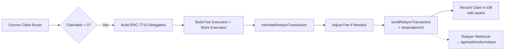
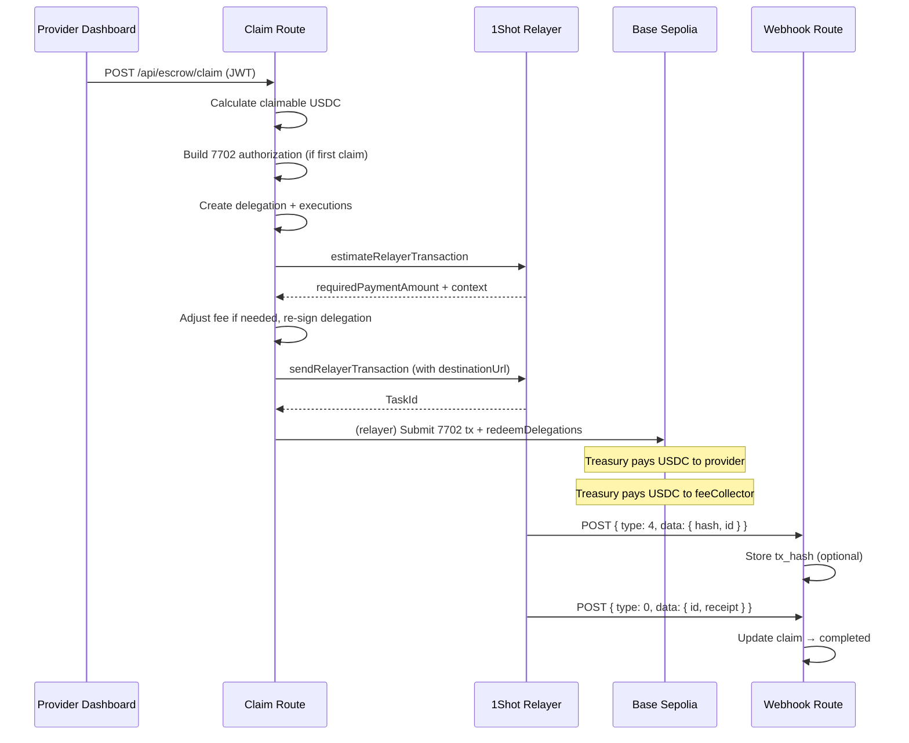

# 1Shot Permissionless Relayer — Implementation Plan

## Gap Assessment (from code analysis)

| Criteria | Status | What's Missing |
|---|---|---|
| Relay 7710 txns through 1Shot Permissionless relayer | **NOT MET** | `relayer_send7710Transaction` defined but never called. Claims use `executeMethod` (business API) instead |
| Use 7702 authorizations to upgrade EOAs through relayer | **NOT MET** | `signAuthorization` / `authorizationList` / `Implementation.Stateless7702` — zero usage in source code. Uses `Implementation.Hybrid` via Pimlico bundler |

**Also missing (bonus points criteria):**
- `destinationUrl` never passed to relayer → webhooks not used for relayer status updates
- Existing webhook handler (`/api/webhooks/oneshot`) expects old 1Shot platform format, not relayer webhook format
- `buildRelayerDelegation` defined but never invoked

---

## Phase 1: Provider Claim via Permissionless Relayer

Replace the current `executeMethod` (1Shot business API OAuth2) with `relayer_send7710Transaction` so the claim flow goes through the **permissionless relayer**.

### Architecture



### 1a. Add Treasury Private Key to .env

The treasury wallet needs a private key so we can create a `7702StatelessDelegator` smart account and sign delegations.

**`.env.example` additions:**
```env
# Treasury EOA Private Key (for Permissionless Relayer claims)
# The corresponding address must match NEXT_PUBLIC_PAY_TO_ADDRESS
TREASURY_PRIVATE_KEY=your-treasury-private-key
```

### 1b. Create Relayer Claim Module

New file: `src/lib/oneshot/relayer-claim.ts`

This module handles the full flow: build delegation → estimate → send → get status.

```typescript
import { createPublicClient, http, encodeFunctionData, erc20Abi, parseUnits } from "viem"
import { baseSepolia } from "viem/chains"
import { privateKeyToAccount } from "viem/accounts"
import {
  toMetaMaskSmartAccount,
  Implementation,
  createDelegation,
  getSmartAccountsEnvironment,
  ScopeType,
} from "@metamask/smart-accounts-kit"
import {
  getRelayerCapabilities,
  estimateRelayerTransaction,
  sendRelayerTransaction,
} from "./client"
import type { Estimate7710TransactionResult } from "./client"
import { toRelayerJson } from "./to-relayer-json"

const CHAIN_ID = "84532"
const USDC_ADDRESS = (process.env.NEXT_PUBLIC_USDC_ADDRESS ?? "0x036CbD53842c5426634e7929541eC2318f3dCF7e") as `0x${string}`

export async function claimViaPermissionlessRelayer(
  providerAddress: `0x${string}`,
  amountUsdc: bigint,
  webhookUrl?: string,
): Promise<{ taskId: string; txHash?: string }> {
  const treasuryPk = process.env.TREASURY_PRIVATE_KEY as `0x${string}`
  if (!treasuryPk) throw new Error("TREASURY_PRIVATE_KEY not set")

  const treasuryAccount = privateKeyToAccount(treasuryPk)
  const publicClient = createPublicClient({ chain: baseSepolia, transport: http() })

  // 1. Get relayer capabilities
  const caps = await getRelayerCapabilities([CHAIN_ID])
  const chainCaps = caps[CHAIN_ID]!
  const targetAddress = chainCaps.targetAddress as `0x${string}`
  const feeCollector = chainCaps.feeCollector as `0x${string}`
  const usdcDecimals = Number(
    chainCaps.tokens.find((t: { symbol: string; address: string }) => t.symbol === "USDC")?.decimals ?? 6,
  )

  // 2. Create 7702 smart account for treasury
  const environment = getSmartAccountsEnvironment(baseSepolia.id)
  const statelessDelegatorImpl = environment.implementations.EIP7702StatelessDeleGatorImpl

  const smartAccount = await toMetaMaskSmartAccount({
    client: publicClient,
    implementation: Implementation.Stateless7702,
    address: treasuryAccount.address,
    signer: { account: treasuryAccount },
  })

  // 3. Check if treasury already has code (is upgraded)
  const code = await publicClient.getCode({ address: treasuryAccount.address })
  const needsUpgrade = code === "0x" || code === undefined || code === null

  // 4. Build 7702 authorization if needed
  let authorizationList: unknown[] | undefined
  if (needsUpgrade) {
    const nonce = await publicClient.getTransactionCount({
      address: treasuryAccount.address,
      blockTag: "pending",
    })
    const auth = await treasuryAccount.signAuthorization({
      chainId: baseSepolia.id,
      contractAddress: statelessDelegatorImpl,
      nonce,
    })
    authorizationList = [{
      address: auth.address,
      chainId: auth.chainId,
      nonce: auth.nonce,
      r: auth.r,
      s: auth.s,
      yParity: auth.yParity ?? 0,
    }]
  }

  // 5. Create delegation scoped to USDC transfer amount
  const salt = `0x${Array.from(crypto.getRandomValues(new Uint8Array(32)))
    .map((b) => b.toString(16).padStart(2, "0")).join("")}` as `0x${string}`

  const delegation = createDelegation({
    to: targetAddress,
    from: smartAccount.address,
    environment: smartAccount.environment,
    salt,
    scope: {
      type: ScopeType.Erc20TransferAmount,
      tokenAddress: USDC_ADDRESS,
      maxAmount: amountUsdc + parseUnits("0.01", usdcDecimals), // amount + fee buffer
    },
  })
  const signature = await smartAccount.signDelegation({ delegation })
  const signedDelegation = { ...delegation, signature }

  // 6. Build executions (fee transfer + work transfer)
  const mockFeeAmount = parseUnits("0.01", usdcDecimals) // ≥ minFee
  const feeCalldata = encodeFunctionData({
    abi: erc20Abi,
    functionName: "transfer",
    args: [feeCollector, mockFeeAmount],
  })
  const workCalldata = encodeFunctionData({
    abi: erc20Abi,
    functionName: "transfer",
    args: [providerAddress, amountUsdc],
  })

  const sendParams = {
    chainId: CHAIN_ID,
    ...(authorizationList ? { authorizationList } : {}),
    transactions: [{
      permissionContext: [toRelayerJson(signedDelegation)],
      executions: [
        { target: USDC_ADDRESS, value: "0", data: feeCalldata },
        { target: USDC_ADDRESS, value: "0", data: workCalldata },
      ],
    }],
  }

  // 7. Estimate first (preferred flow)
  const estimate = await estimateRelayerTransaction(sendParams) as Estimate7710TransactionResult
  if (!estimate.success) throw new Error(`Relayer estimate failed: ${estimate.error}`)

  const requiredFee = BigInt(estimate.requiredPaymentAmount!)
  if (requiredFee !== mockFeeAmount) {
    // Rebuild delegation with correct fee + re-sign
    const adjustedDelegation = createDelegation({
      to: targetAddress,
      from: smartAccount.address,
      environment: smartAccount.environment,
      salt,
      scope: {
        type: ScopeType.Erc20TransferAmount,
        tokenAddress: USDC_ADDRESS,
        maxAmount: amountUsdc + requiredFee,
      },
    })
    const adjustedSig = await smartAccount.signDelegation({ delegation: adjustedDelegation })
    const adjustedSigned = { ...adjustedDelegation, signature: adjustedSig }
    sendParams.transactions[0].permissionContext = [toRelayerJson(adjustedSigned)]
  }

  // 8. Submit with price lock and destinationUrl
  const taskId = await sendRelayerTransaction({
    ...sendParams,
    context: estimate.context,
    destinationUrl: webhookUrl ?? `${process.env.NEXT_PUBLIC_APP_URL}/api/webhooks/relayer`,
    memo: `claim-${Date.now()}`,
  }) as string

  return { taskId }
}
```

### 1c. Create toRelayerJson Utility

New file: `src/lib/oneshot/to-relayer-json.ts`

```typescript
import { bytesToHex } from "viem/utils"

/**
 * Converts delegation bigints / Uint8Arrays into JSON-safe shapes
 * for relayer JSON-RPC submission.
 */
export function toRelayerJson(value: unknown): unknown {
  if (value === null || value === undefined) return value
  if (typeof value === "bigint") return `0x${value.toString(16)}`
  if (value instanceof Uint8Array) return bytesToHex(value)
  if (Array.isArray(value)) return value.map(toRelayerJson)
  if (typeof value === "object") {
    const out: Record<string, unknown> = {}
    for (const [k, v] of Object.entries(value)) out[k] = toRelayerJson(v)
    return out
  }
  return value
}
```

### 1d. Rewrite Escrow Claim Route

Modify `app/api/escrow/claim/route.ts`:

Replace the `executeMethod` block (lines 108-134) with the new `claimViaPermissionlessRelayer` function. Keep the JWT auth, DB queries, and claim recording logic the same.

```typescript
// In the POST handler, REPLACE lines 108-134 with:
import { claimViaPermissionlessRelayer } from "@/lib/oneshot/relayer-claim"

// ... [existing logic to calculate claimable amount] ...

const claimableWei = BigInt(Math.floor(claimable * 10 ** 6)) // USDC 6 decimals
const webhookUrl = `${process.env.NEXT_PUBLIC_APP_URL}/api/webhooks/relayer`

const { taskId } = await claimViaPermissionlessRelayer(
  provider.wallet_address as `0x${string}`,
  claimableWei,
  webhookUrl,
)

// Store taskId in claim_history for status tracking
const { error: insertError } = await supabase
  .from("claim_history")
  .insert({
    provider_id: provider.id,
    amount_usdc: String(claimable),
    task_id: taskId,          // NEW: store relayer taskId
    tx_hash: null,            // will be populated by webhook
    status: "pending",
  })
```

Also add `task_id` to the `claim_history` schema:

```sql
ALTER TABLE claim_history ADD COLUMN task_id text;
```

### 1e. New Relayer Webhook Endpoint

Create `app/api/webhooks/relayer/route.ts`:

This endpoint handles **relayer webhooks** (Ed25519 signed) instead of old 1Shot platform webhooks.

**Schema reference** (from `.agents/skills/public-relayer/references/schemas.md`):
```typescript
type OutboundWebhook = {
  apiVersion: 0
  type: 0 | 1 | 4           // 4=Submitted, 0=Success, 1=Failure
  data: {                    // same as relayer_getStatus response
    id: `0x${string}`
    status: 100 | 110 | 200 | 400 | 500
    memo?: string
    hash?: `0x${string}`
    receipt?: { blockHash, blockNumber, gasUsed, ... }
    message?: string
  }
  timestamp: number
  keyId: string
  signature: string          // base64 Ed25519
}
```

```typescript
import { NextRequest, NextResponse } from "next/server"
import { createClient } from "@/lib/supabase-server"

export async function POST(request: NextRequest) {
  try {
    const body = await request.json()
    const data = body.data as { id: string; status: number; memo?: string; hash?: string; receipt?: unknown }

    // Skip non-terminal statuses
    if (body.type === 4) {
      // Submitted: store tx hash
      if (data.hash) {
        // Update claim_history with tx_hash from submitted event
      }
      return NextResponse.json({ received: true })
    }

    if (body.type === 0) {
      // Confirmed (status 200)
      // Update claim_history status to "completed"
      const { data: _result, error } = await supabaseClient
        .from("claim_history")
        .update({ status: "completed", tx_hash: data.hash ?? null })
        .eq("task_id", data.id)

      if (error) console.error("[relayer-webhook] DB update error:", error)
      return NextResponse.json({ received: true })
    }

    if (body.type === 1) {
      // Failure (status 400 or 500)
      // Update claim_history status to "failed"
      const { error } = await supabaseClient
        .from("claim_history")
        .update({ status: "failed", tx_hash: data.hash ?? null })
        .eq("task_id", data.id)

      if (error) console.error("[relayer-webhook] DB update error:", error)
      return NextResponse.json({ received: true })
    }

    return NextResponse.json({ received: true })
  } catch (err) {
    console.error("[relayer-webhook] Error:", err)
    return NextResponse.json({ error: "Internal server error" }, { status: 500 })
  }
}
```

> **Note**: For the hackathon demo, skip Ed25519 webhook verification (addressee: "optional, bonus points"). Implement it if time permits using `@noble/ed25519` + `safe-stable-stringify` as shown in `SKILL.md` Example 5.

---

## Phase 2: Switch to Implementation.Stateless7702

The current `useSmartAccount.ts` uses `Implementation.Hybrid` (lines 59-63). The 1Shot permissionless relayer works with `Implementation.Stateless7702`.

**Change in `src/hooks/useSmartAccount.ts`:**

```typescript
// OLD (line 60):
implementation: Implementation.Hybrid,

// NEW:
implementation: Implementation.Stateless7702,
```

Also remove the `deployParams` argument since `Stateless7702` doesn't need it:

```typescript
toMetaMaskSmartAccount({
  client: publicClient,
  implementation: Implementation.Stateless7702,
  address,                          // required for Stateless7702
  // no deployParams needed
})
```

> **Note**: With `Stateless7702`, the EOA must be EIP-7702 upgraded (code on-chain pointing to the delegator contract). The relayer's `authorizationList` handles this upgrade during the first transaction. In the browser, MetaMask extension handles it via `requestExecutionPermissions`.

---

## Phase 3: End-to-End Flow Verification

### Data flow for provider claim (the primary deliverable):



### Verification checklist:

| Item | How to Verify |
|---|---|
| `relayer_send7710Transaction` called | Add a log in `sendRelayerTransaction` or check server logs for "relayer_send7710Transaction RPC error" — no error = success |
| 7702 authorization included | Check `authorizationList` is non-empty in the params sent to relayer |
| `destinationUrl` set | Verify the webhook endpoint receives POST requests |
| USDC transfer succeeds | Check provider wallet on BaseScan for incoming USDC |
| Webhook updates DB | Query `claim_history` where `task_id` is non-null and `status = "completed"` |
| No `executeMethod` used | Confirm `escrow/claim/route.ts` no longer imports or calls `executeMethod` |

---

## Phase 4: Optional — Ed25519 Webhook Verification

For full production-grade compliance (bonus points for judges).

### Dependencies
```bash
npm install @noble/ed25519 safe-stable-stringify
```

### Implementation

Follow **Example 5** from `.agents/skills/public-relayer/references/examples.md`:

1. Add `verifyRelayerWebhook()` function to `src/lib/oneshot/`
2. Call it as middleware in the webhook route handler
3. Cache JWKS from `https://relayer.1shotapi.com/.well-known/jwks.json`

---

## Reference Material

| Resource | Location |
|---|---|
| 1Shot Public Relayer SKILL | `.agents/skills/public-relayer/SKILL.md` |
| Full JSON-RPC Schemas | `.agents/skills/public-relayer/references/schemas.md` |
| Copy-Paste Examples | `.agents/skills/public-relayer/references/examples.md` |
| MetaMask Smart Accounts Kit Docs | `https://docs.metamask.io/smart-accounts-kit/` |
| EIP-7702 Quickstart | `https://docs.metamask.io/smart-accounts-kit/get-started/smart-account-quickstart/eip7702/` |
| x402 + Delegation Guide | `https://docs.metamask.io/smart-accounts-kit/guides/x402/buyer/delegations/` |
| 1Shot API Docs | `https://docs.1shotapi.com/` |
| Reference Implementation | `https://github.com/thesithunyein/delegate` (similar architecture) |

## Dependency Map

```mermaid
flowchart TD
    subgraph "New Code"
        RC[relayer-claim.ts]
        TRJ[to-relayer-json.ts]
        WH2[/api/webhooks/relayer]
    end

    subgraph "Existing Code (Modified)"
        ESCROW[/api/escrow/claim/route.ts]
        SMART[useSmartAccount.ts]
        ENV[.env.example]
    end

    subgraph "Existing Code (Unchanged)"
        CLIENT[oneshot/client.ts]
        RELAYER[oneshot/relayer.ts]
        INDEX[oneshot/index.ts]
        RCONFIG[/api/providers/relayer-config/route.ts]
    end

    ESCROW --> RC
    RC --> CLIENT
    RC --> TRJ
    RC --> SMART

    WH2 -.->|optional| ENV
    SMART --> ENV
```

---

## Summary of Changes

| File | Action | Lines Changed |
|---|---|---|
| `src/lib/oneshot/relayer-claim.ts` | **NEW** | ~130 lines |
| `src/lib/oneshot/to-relayer-json.ts` | **NEW** | ~25 lines |
| `app/api/escrow/claim/route.ts` | **MODIFY** | Replace `executeMethod` (lines 108-134) with relayer flow |
| `app/api/webhooks/relayer/route.ts` | **NEW** | ~60 lines |
| `src/hooks/useSmartAccount.ts` | **MODIFY** | Change `Hybrid` → `Stateless7702`, remove `deployParams` (lines 58-63) |
| `.env.example` | **MODIFY** | Add `TREASURY_PRIVATE_KEY` |
| `supabase/migrations/` | **NEW** | Add `task_id` to `claim_history` |
