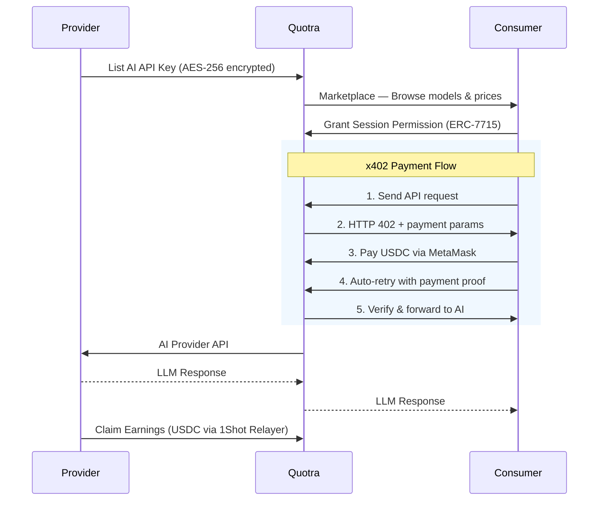

# Quotra — Decentralized P2P AI API Marketplace

  <strong>Sell your idle AI quota, buy LLM access per-call — no credit card, no commitment.</strong>

  
  
  
  

  Built for <strong>MetaMask Smart Accounts Kit × 1Shot API Dev Cook-Off</strong> — June 2026

---

## The Problems

### Problem 1: The Credit Card Wall

Premium AI APIs from OpenAI, Anthropic, and Google require a credit card to get started. Millions of developers, students, and builders in Southeast Asia, Latin America, and Africa cannot access these tools because they do not have credit cards or face regional billing restrictions.

A computer science student in Jakarta wants to build an AI chatbot for a class project. He has the skills, the idea, and a MetaMask wallet with some USDC. But no credit card. He cannot even start.

### Problem 2: Idle Subscription Waste

Premium AI subscriptions cost $20–$68 per month, yet most users consume only a fraction of their allocated credits. Unused credits expire at the end of each billing cycle with no refund.

There is currently no way for subscribers to resell their idle quota to others who need temporary access.

---

## Enter Quotra

Quotra is a decentralized peer-to-peer marketplace where AI quota holders can sell their unused API access, and anyone can buy LLM calls per-request using USDC — no credit card, no subscription, no commitment.

Think Airbnb for AI quota. Providers list their spare capacity. Consumers pay per call. The marketplace handles trust, payments, and routing.

### What Makes Quotra Different

- **P2P by design** — 90% of every payment goes to the individual provider, not a centralized platform
- **No credit card required** — Pay with USDC from any crypto wallet
- **No ETH needed** — MetaMask Smart Accounts + 1Shot Relayer cover all gas costs
- **On-chain trust** — ERC-7710 delegation makes provider consent cryptographically verifiable and revocable

---

## How It Works

### Step by Step

**1. Provider Lists Quota**
A provider connects their MetaMask wallet, enters their AI API key (OpenAI/Anthropic/Gemini), sets a per-call price ($0.0001 to $1.00), and defines limits (max calls, input length, expiry). The key is encrypted with AES-256-GCM before it touches the database. The listing goes live on the marketplace.

**2. Consumer Discovers & Permissions**
A consumer browses active listings, filters by model or price, and can test any model for free (3 calls per listing in the Playground). To start paying, they grant an ERC-7715 session permission via MetaMask — a one-time approval that creates an ephemeral session.

**3. Pay-per-Call via x402**
The consumer calls the API endpoint. The server returns HTTP 402 Payment Required with a price quote. MetaMask processes the USDC payment through the x402 Facilitator. The client automatically retries with a payment proof. The server verifies and proceeds.

**4. AI Response**
The server decrypts the provider's API key in memory, validates request limits, calls the upstream AI provider, and streams the response back. The consumer gets a standard OpenAI-compatible response.

**5. Provider Claims Earnings**
Earnings accumulate in the Quotra treasury (90% provider share, 10% platform fee). The provider visits their dashboard and clicks "Claim." The treasury signs an ERC-7710 delegation, and the 1Shot Permissionless Relayer executes the USDC transfer — no ETH needed from the provider.

---

## Key Features

### P2P Marketplace

Browse active listings from real AI subscribers. Filter by model name, price per call, or remaining quota. See provider reputation through truncated wallet addresses. No account required to browse.

### Pay-per-Call (x402)

Pay only for what you use. Each API call costs a fixed USDC amount set by the provider — typically $0.0001 to $0.001. No monthly subscription, no minimum spend, no surprise bills.

### Free Playground Trial

Try any model 3 times for free before committing. Full streaming chat UI with markdown rendering. No wallet connection needed. Instant feedback on model quality and speed.

### ETH-Free Experience

Neither providers nor consumers need ETH for gas. MetaMask Smart Accounts (ERC-7702) eliminate the need for EOAs. The 1Shot Permissionless Relayer covers all transaction costs, paid in USDC.

### Escrow Treasury Model

All payments settle to the Quotra treasury first. If an AI provider call fails, the consumer gets refunded from the treasury. Providers claim their accumulated earnings on demand. No on-chain splits per call.

### Multi-Key Support

One provider can list multiple API keys with independent settings — different models, prices, limits, and expiry dates. Each listing is independent. Revoking one does not affect others.

---

## Who It Is For

### Adit — The Consumer

_Computer science student, Indonesia, 20 years old_

Adit needs to build an AI chatbot for his final project. He has a MetaMask wallet with some USDC but no credit card. With Quotra, he connects his wallet, browses available models, pays $0.001 per call from his USDC balance, and calls the API like any standard endpoint.

### Rina — The Provider

_Freelance developer, Jakarta, 27 years old_

Rina pays $68/month for Anthropic Pro+ but uses only 30% of her credits. She lists her spare 5,000 credits on Quotra at $0.001/call. If fully consumed, she earns $4.50 USDC — reducing her net subscription cost from $68 to $63.50. Passive income from existing spend.

### Bimo — The Hackathon Builder

_Hackathon participant, needs LLM access fast_

Bimo has 48 hours to build a demo. No time to set up OpenAI billing. He opens Quotra, connects his wallet, finds a model, and starts coding in minutes. No forms, no approval, no delays.

---

## Business Model

### Revenue Split

| Recipient       | Share | Example ($0.001 call) |
| --------------- | ----- | --------------------- |
| Provider        | 90%   | $0.0009               |
| Quotra platform | 10%   | $0.0001               |

Every consumer payment flows to the Quotra treasury. Provider earnings accrue in the database. The platform fee stays in the treasury permanently after providers claim their share.

### Provider Economics Example

Rina's Anthropic Pro+ subscription ($68/month, 7,500 credits):

- Lists 5,000 unused credits on Quotra at $0.001/call
- Full consumption: 5,000 × $0.0009 = **$4.50 USDC earned**
- Effective subscription cost: $68 - $4.50 = **$63.50/month**
- She earns passive income from capacity she was already paying for

### Platform Revenue Projections

| Daily Calls | Avg Price/Call | Daily Platform Revenue |
| ----------- | -------------- | ---------------------- |
| 1,000       | $0.001         | $0.10                  |
| 10,000      | $0.001         | $1.00                  |
| 100,000     | $0.001         | $10.00                 |

---

## Competitive Landscape

| Dimension              | Quotra                    | OpenRouter                | Replicate                 | AI/ML API                 |
| ---------------------- | ------------------------- | ------------------------- | ------------------------- | ------------------------- |
| Payment method         | USDC per call             | Fiat + crypto             | Fiat only                 | Fiat only                 |
| Model selection        | Limited to listed quotas  | 300+ models               | OSS models + fine-tuned   | 200+ models               |
| Provider model         | P2P marketplace           | Centralized aggregator    | Cloud infrastructure      | Cloud infrastructure      |
| Reliability            | Depends on providers      | Platform-managed          | Platform-managed SLA      | Platform-managed SLA      |
| No credit card needed  | Yes                       | Partial (crypto top-up)   | No                        | No                        |
| ETH-free               | Yes                       | N/A                       | N/A                       | N/A                       |
| Revenue to provider    | 90%                       | Platform sets margin      | Platform sets pricing     | Platform sets pricing     |
| Latency                | Extra hop via Quotra      | Direct routing            | Direct routing            | Direct routing            |
| Maturity               | Hackathon MVP             | Established (since 2023)  | Established (since 2019)  | Established (since 2023)  |

### Where Each Excels

**OpenRouter** offers the widest model selection with reliable infrastructure and a frictionless developer experience. It supports crypto top-ups, lowering the entry barrier partially. However, it is a centralized reseller — you pay OpenRouter's margin, and pricing follows their wholesale agreements.

**Replicate** excels at open-source model hosting with a strong developer API, versioning, and scaling. It charges platform-determined pricing per second of compute. It is not designed for proprietary API resale.

**AI/ML API** provides enterprise-grade reliability and an OpenAI-compatible endpoint for 200+ models but requires fiat billing and centralized payment processing.

**Quotra** is the only P2P option — 90% of revenue goes to providers, anyone can join without a credit card, and the entire flow is ETH-free. The trade-offs are equally real: model selection depends entirely on what individuals choose to list, reliability varies per provider (Quotra cannot guarantee uptime), and every request goes through an extra routing hop, adding latency versus direct API calls. As a hackathon MVP, Quotra also lacks the maturity, SLAs, and polish of its competitors.

---

## The Technology (Plain English)

### Smart Accounts (No ETH Needed)

MetaMask Smart Accounts Kit converts any wallet into a smart account using ERC-7702. This means users can sign transactions without needing ETH for gas. The 1Shot Relayer pays the gas fees and charges the cost in USDC instead.

### ERC-7710 Delegation (Crypto Permission Slip)

ERC-7710 is a standard for delegating authority on Ethereum. In Quotra, providers sign a delegation that says "this consumer is allowed to use my API key up to this limit." The delegation is stored on-chain — auditable, revocable, and cryptographically provable.

### x402 Protocol (Pay-per-Call HTTP)

x402 is a protocol that repurposes the HTTP 402 Payment Required status code into a working micropayment system. When a consumer calls the API without payment, the server responds with 402 and payment parameters. The consumer's wallet automatically pays USDC and retries. The whole flow takes seconds.

### Ed25519 Webhook Verification

When the 1Shot Relayer completes a payout, it sends a signed webhook to Quotra's server. The signature is verified using Ed25519 cryptography with keys fetched from the relayer's JWKS endpoint. This ensures only legitimate relayer callbacks can update claim statuses.

---

## Tech Stack Summary

| Category       | Technology                                        |
| -------------- | ------------------------------------------------- |
| Framework      | Next.js 16 (App Router), TypeScript               |
| Frontend       | Tailwind CSS v4, Radix UI, shadcn/ui              |
| Smart Accounts | MetaMask Smart Accounts Kit (ERC-7702)            |
| Delegation     | ERC-7710                                          |
| Permissions    | ERC-7715                                          |
| Micropayments  | x402 Protocol (@x402/next, @metamask/x402)        |
| Relayer        | 1Shot Permissionless Relayer                      |
| Database       | Supabase (PostgreSQL + RLS)                       |
| Network        | Base Sepolia Testnet                              |
| Payment Token  | USDC (Base Sepolia)                               |
| AI Providers   | OpenAI, Anthropic, Google Gemini                  |
| Testing        | Vitest, jsdom, @testing-library/react (85+ tests) |

---

## Current Status & Roadmap

### MVP (June 2026 — Hackathon) ✅

- Provider onboarding with encrypted API key storage
- Consumer marketplace with filter and search
- ERC-7710 delegation via MetaMask Smart Accounts
- ERC-7715 session permissions
- x402 per-call USDC payments
- Free playground (3 trial calls per listing)
- Provider claim flow with 1Shot Relayer
- Ed25519 webhook verification
- 85+ automated tests
- Base Sepolia testnet deployment

### Next Up (Post-Hackathon)

- Provider/consumer rating and review system
- Mainnet deployment
- Streaming responses for paid gateway
- Pre-funded consumer deposit wallets
- On-chain quota enforcement via ERC-7710 caveats
- Automated batch settlement
- Multi-chain support
- Mobile-responsive web app

---

## Built For

**MetaMask Smart Accounts Kit × 1Shot API Dev Cook-Off**

Tracks: _Best Use of x402 + ERC-7710_ and _Best 1Shot API Project_

Submission target: 15 June 2026

---

  <a href="https://quotra.app">Live Demo</a> ·
  <a href="https://github.com/your-org/quotra-app">GitHub Repository</a> ·
  <a href="docs/quotra-prd-v2.md">Full PRD</a>

  <em>Built for a more accessible AI future — where anyone with USDC and an idea can build anything.</em>

